<picture>
  <source media="(prefers-color-scheme: dark)" srcset="assets/hero-dark.svg">
  <source media="(prefers-color-scheme: light)" srcset="assets/hero-light.svg">
  
</picture>

## About

I came to software from the operations side of a business. Before I wrote code for anything that mattered, I worked inside administrative processes — permit applications, document deadlines, client requests — and then in IT support, fixing machines and unblocking the people who depended on them.

That is why my projects tend to start from a process rather than from a framework. I know what a stuck permit or a broken workstation costs someone, and it shows in what I choose to build.

Today I write backend systems in **Java** and **Spring Boot**: REST APIs, domain modelling, authentication, and integrations with storage and AI services. I am finishing a degree in Systems Analysis and Development, and most of what I learn goes straight into projects that try to solve a real process instead of a textbook exercise.

## Featured Projects

**[SIAPS — Sanitary permit triage](https://github.com/JoaoDev30/Sistema-Triagem-para-Prefeitura)** 
Health-surveillance officers review permit applications by hand, document by document. SIAPS ingests the files, runs an AI pass that flags missing paperwork and inconsistencies, and returns a structured opinion — the officer still makes the decision. 
Java · Spring Boot · Spring Security + JWT · Spring Data JPA · PostgreSQL · AWS S3 · OpenAI API · Maven 
Layered architecture — controller / service / repository / entity, with DTOs split by direction and a global exception handler.

**[FOLH.IA — Environmental compliance for rural producers](https://github.com/JoaoDev30/Projeto-FOLH.IA-main)** 
Brazilian forest law is dense enough that smallholders miss deadlines they never knew existed. FOLH.IA answers questions in plain language, grounded in the legislation itself through semantic search, and reaches producers over WhatsApp with regularisation reminders. 
TypeScript · Node/Express · React · Supabase (Postgres + pgvector) · Google Gemini · Docker 
Five independent services behind a single gateway, each with its own Dockerfile.

**[RankStudy — Gamified study tracking](https://github.com/JoaoDev30/RankStudy)** 
Studying alone is where consistency dies. RankStudy turns study hours into XP, streaks and weekly challenges between friends, so the accountability comes from the group. 
Python · FastAPI · PostgreSQL · Redis · Flutter · Docker · Alembic 
In development — backend and mobile scaffolding in place, CI running on both.

**[PicPay Simplificado — Payments backend](https://github.com/JoaoDev30/-picpaysimplificado)** 
PicPay's official backend challenge: transfers between users and merchants, with the business rules that make a payment service refuse a transaction — insufficient balance, merchants barred from sending, unknown payer or payee. 
Java 21 · Spring Boot 3.5 · Spring Data JPA · H2 · Maven

## Stack

**Backend** — Java 21 · Spring Boot · Spring Data JPA · Spring Security (JWT) · REST APIs · Maven

**Data** — PostgreSQL · MySQL · H2

**Infrastructure** — Docker · AWS S3 · Linux · Git · GitHub Actions

**Also work with** — Python · TypeScript · JavaScript · HTML · CSS

## Contributions

<picture>
  <source media="(prefers-color-scheme: dark)" srcset="https://raw.githubusercontent.com/JoaoDev30/JoaoDev30/output/snake-dark.svg">
  <source media="(prefers-color-scheme: light)" srcset="https://raw.githubusercontent.com/JoaoDev30/JoaoDev30/output/snake-light.svg">
  
</picture>

<picture>
  <source media="(prefers-color-scheme: dark)" srcset="profile-summary-card-output/github_dark/1-repos-per-language.svg">
  <source media="(prefers-color-scheme: light)" srcset="profile-summary-card-output/github/1-repos-per-language.svg">
  
</picture>
<picture>
  <source media="(prefers-color-scheme: dark)" srcset="profile-summary-card-output/github_dark/2-most-commit-language.svg">
  <source media="(prefers-color-scheme: light)" srcset="profile-summary-card-output/github/2-most-commit-language.svg">
  
</picture>
<picture>
  <source media="(prefers-color-scheme: dark)" srcset="profile-summary-card-output/github_dark/3-stats.svg">
  <source media="(prefers-color-scheme: light)" srcset="profile-summary-card-output/github/3-stats.svg">
  
</picture>

The snake and the cards above are regenerated daily by GitHub Actions in this repository — no third-party server sits in the render path. See [`.github/workflows`](.github/workflows).

## Elsewhere

[LinkedIn](https://www.linkedin.com/in/jo%C3%A3o-miguel-da-silva-sousa-00484431a/)

Finishing my Systems Analysis and Development degree and open to backend roles. The fastest way to know how I work is to read the code above.
